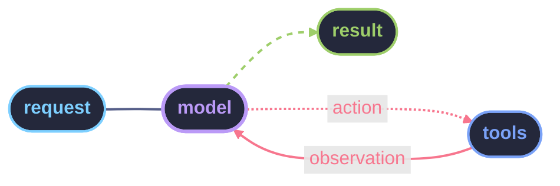

---
{"dg-publish":true,"permalink":"/02 - Knowledge/AI/Agent/AI Agent/","tags":["type/study","context/studies","theme/ai","status/completed"]}
---

## 배경
### 기존 개발 방식의 한계
- 기존 개발 방식의 한계는 비교적 단순하다는 것
	- 반복 작업 많음
	- 사소한 코드 작성과 수정에 시간이 든다
	- 맥락 전환(문서 <-> 코드 <-> 테스트)이 잦다
- 위 문제를 해결하기 위해 등장한 것이 **AI 코딩 어시스턴트**

> [!TIP]
> - 맥락 전환 비용은 눈에 잘 보이지 않음
> 	- 맥락 전환 시 이전 맥락을 다시 떠올리는 데 드는 인지 비용이 더 큼
> 	ex) API 스펙 문서 -> 코드 작업 뒤, 테스트 실패 원인을 다시 문서에서 찾는 과정

### LLM 단독 사용(Chat 형태)의 한계
- AI 어시스턴트라고 부르면서 실제로는 Chat 형태 LLM을 그대로 사용함
	- 하나의 세션 안에서 요구사항 정리, 구현, 검증이 뒤섞임
	- 이전 맥락이 다음 판단에 영향을 줌
	- AI가 어떤 역할로 응답하고 있는지 알 수 없음
	- 결과가 나빠도 어디서 잘못됐는지 추적이 불가능
> [!result]
> - AI가 문제인 게 아니라 AI를 단일 어시스턴트로만 사용하는 구조가 문제

### 에이전트 개념의 등장 배경
- 하나의 AI에게 여러 종류의 일을 동시에 맡겨서 실패한다면?
- 역할을 나눠서 실행하자
- 이 역할들을 사람 또는 시스템이 순서대로 호출하자
> [!result]
> - 에이전트는 AI를 통제하려는 시도의 결과물이다.

## Agents vs. Models

| 항목 | 단순 모델 (LLM) | AI 에이전트 |
|------|----------------|------------|
| **지식 범위** | 학습 데이터 시점까지 고정 | 도구를 통해 실시간 정보 접근 가능 |
| **세션 기억** | 단일 컨텍스트 창 내에서만 유지 | 메모리 레이어로 장기 기억 가능 |
| **도구 사용** | 없음 (텍스트 생성만) | API 호출, 코드 실행, DB 조회 등 |
| **로직 레이어** | 단일 추론 → 응답 | 반복적 추론-행동-관찰 루프 |

> [!result]
> 에이전트는 LLM에 **행동 능력**과 **반복 실행 구조**를 더한 것이다.

---

## AI Agent란?

### AI Agent
- 에이전트는 단일 응답을 생성하는 구조와 다름
- 하나의 목표를 두고, 생각->행동->관찰을 반복하며 다음 단계를 결정하는 실행 구조
	- Reason:  지금 상황에서 무엇을 해야 할지 판단
	- Act: 선택한 행동 실행(도구 호출, 코드 수정 등)
	- Observe: 실행 결과를 확인
	- 이 결과를 다시 Reason 단계로 되돌림
- 핵심은 위 행동을 사람이 아니라 시스템이 결정한다는 점

### AI Agent는 만능인가?
- 추론 과정을 거쳐서 검증한 결과를 도출하지만 실패하지 않는 것은 아님
- 에이전트는 여러 단계를 자동으로 실행할 수 있지만, 그만큼 실패 양상도 기존 어시스턴트와 다를 뿐
	- 변경 범위가 커짐
	- 사람이 검증하기 전에 다음 단계를 넘어감
	- 실패 지점이 어디인지 알기 어려움

### 실패 사례
#### 변경 범위
- 에이전트는 목표 달성을 위해 과도하게 넓은 범위에 대한 수정
	- 일부는 불필요하거나 위험한 변경이 포함됨
	- 코드 리뷰와 롤백 비용 증가
#### 잘못된 연쇄 실행
- 초기 판단이 틀려도 그 판단을 전제로 다음 행동을 이어감
	- 잘못된 요구 해석 -> 잘못된 코드 생성 -> 그 코드를 기준으로 한 테스트 수정
	- 코드 리뷰와 롤백 비용 증가
#### 책임 위치 불명확
- 에이전트가 여러 단계를 자동 실행하면 다음 질문에 답하기 어려움
	- 이 변경은 왜 들어갔는가
	- 누가 이 결정을 내렸는가
	- 어디까지가 의도된 수정인가
- 위 질문에 답할 수 없는 상태 자체가 리스크가 큼

### 문제는 도구가 아니라 사용 방식
- 에이전트 도구들은
	- 여러 파일 변경을 제안
	- 다음 작업을 연속적으로 제시
	- 사용자가 개입하지 않아도 계속 진행하는 것 처럼 보임
	- 잘못된 요구 해석 -> 잘못된 코드 생성 -> 그 코드를 기준으로 한 테스트 수정
- 에이전트를 통제 없이 쓰는 것이 문제이다.