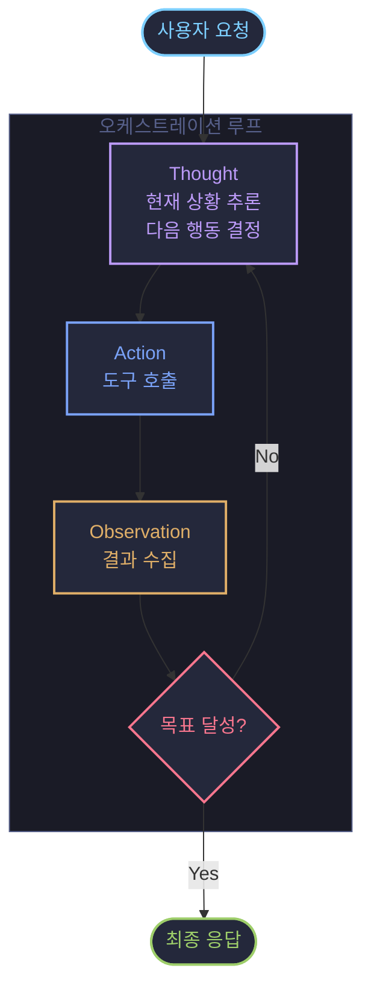

---
{"dg-publish":true,"permalink":"/02 - Knowledge/AI/Agent/Agent Architecture/","tags":["type/study","context/academic","theme/ai","status/in-progress"]}
---

# Agent Architecture
> 에이전트의 사고 구조: 어떻게 정보를 받고 판단하고 행동하는가

## 인지 아키텍처란 (Cognitive Architecture)

- 에이전트가 **정보를 인식하고, 추론하고, 행동을 결정하는 전체 구조**
- 단순 LLM 호출과 달리, 에이전트는 목표 달성을 위해 반복적인 판단-행동 루프를 가짐
- 입력(Input) → 추론(Reasoning) → 행동(Action) → 관찰(Observation) → 다시 추론

> [!info] 핵심 구성 요소
> - **모델 (Model)**: 추론을 담당하는 LLM (에이전트의 "두뇌")
> - **오케스트레이션 레이어 (Orchestration Layer)**: 판단-행동 루프를 조율하는 시스템
> - **도구 (Tools)**: 에이전트가 외부 세계와 상호작용하는 수단 → [[02 - Knowledge/AI/Agent/Agent Tools\|Agent Tools]] 참고

---

## 오케스트레이션 레이어 (Orchestration Layer)

- 에이전트의 **"지휘부"**: 무엇을 할지 결정하고, 도구를 언제 호출할지 관리
- 실행 흐름:
  1. 사용자 요청 수신
  2. 현재 상태 파악 (메모리/컨텍스트 확인)
  3. 다음 행동 결정 (도구 호출 or 최종 응답)
  4. 행동 실행 및 결과 수집
  5. 목표 달성 여부 판단 → 미달 시 루프 반복

> [!TIP]
> 오케스트레이션 레이어는 **에이전트의 자율성 수준**을 결정한다.
> - 단순 레이어: 사전 정의된 순서대로 실행
> - 고급 레이어: 상황에 따라 동적으로 전략 변경 (ReAct 등)

---

## 추론 프레임워크

에이전트가 어떤 방식으로 생각하고 행동할지 결정하는 패턴.

### ReAct (Reasoning + Acting)

- **추론(Reasoning)과 행동(Acting)을 교차**하며 실행하는 프레임워크
- 각 단계에서 "왜 이 행동을 하는지" 명시적으로 추론한 뒤 행동
- 관찰 결과를 다음 추론에 반영 → 동적 계획 수정 가능

**실행 구조:**
```
Thought: 현재 상황 분석, 다음 행동 이유 추론
Action: 도구 호출 또는 응답 생성
Observation: 행동 결과 수집
(반복)
Final Answer: 목표 달성 시 최종 응답
```

> [!example] ReAct 예시
> - Thought: "사용자가 서울 날씨를 묻고 있다. 날씨 API를 호출해야 한다."
> - Action: `weather_api("서울")`
> - Observation: `{"temp": 12, "condition": "맑음"}`
> - Thought: "결과를 받았다. 이제 응답할 수 있다."
> - Final Answer: "서울은 현재 12°C, 맑음입니다."

### Chain-of-Thought (CoT)

- **단계적 추론 과정을 명시적으로 생성**하는 방법
- 복잡한 문제를 작은 단계로 나눠 순서대로 풀어냄
- 도구 호출 없이 모델 내부 추론만으로 처리할 때 유용
- ReAct의 "Thought" 단계를 더 정교하게 구성할 때 활용

> [!TIP]
> CoT는 **단일 LLM 호출** 내에서 추론 품질을 높이는 기법.
> ReAct는 **여러 번의 행동-관찰 루프** 전체를 구조화하는 프레임워크.

### Tree-of-Thoughts (ToT)

- CoT를 **트리 구조로 확장**: 한 번에 여러 추론 경로를 탐색
- 각 경로를 평가하여 가장 유망한 방향으로 진행
- 복잡한 계획 수립, 창의적 문제 해결에 적합
- 계산 비용이 높아 단순 작업에는 과도함

| 프레임워크 | 특징 | 적합한 작업 |
|-----------|------|------------|
| **CoT** | 선형 단계적 추론 | 수학 풀이, 논리 추론 |
| **ReAct** | 추론 + 도구 호출 루프 | 정보 검색, 다단계 작업 |
| **ToT** | 다중 경로 탐색 | 복잡한 계획, 창의적 문제 |

---

## ReAct 실행 흐름



---

## 스스로 묻기
- ReAct와 CoT의 차이를 한 문장으로 설명할 수 있는가?
- Orchestration Layer 없이 에이전트가 동작할 수 있는가?

## 참고 자료
- Google, "Agents" (February 2025) — Julia Wiesinger et al.

[[02 - Knowledge/AI/Agent/_Agent\|_Agent]] | [[02 - Knowledge/AI/Agent/AI Agent\|AI Agent]] | [[02 - Knowledge/AI/Agent/Agent Tools\|Agent Tools]]
