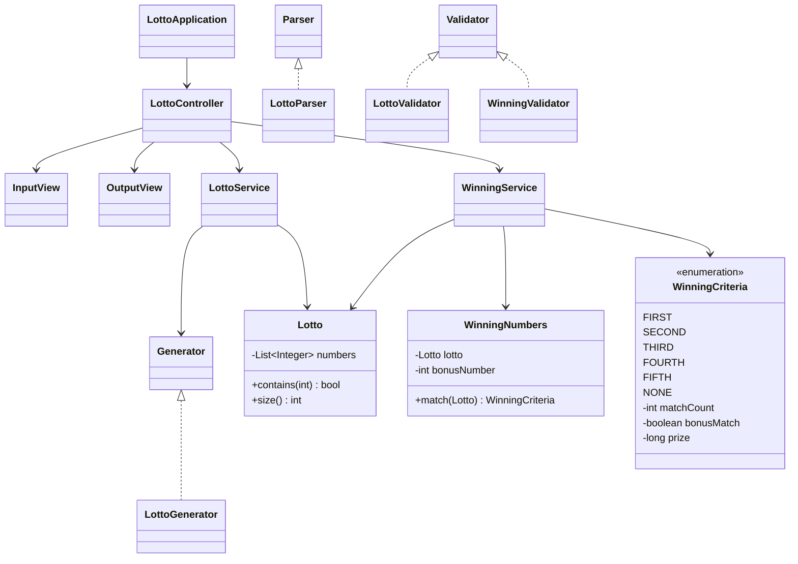

---
{"dg-publish":true,"permalink":"/02 - Knowledge/Computing/Backend/설계/도메인 모델 설계/","tags":["type/study","context/studies","theme/backend","status/completed"]}
---

# 도메인 모델 설계

> 클래스 다이어그램, 의존 관계, 도메인 레이어 구성

## 로또 시스템 클래스 다이어그램



---

## 설계 원칙

### 인터페이스로 추상화
```
Generator (interface)
  └─ LottoGenerator   # 실제 번호 생성 구현체

Parser (interface)
  └─ LottoParser      # 입력 파싱 구현체

Validator (interface)
  └─ LottoValidator   # 로또 번호 검증
  └─ WinningValidator # 당첨 번호 검증
```

→ 테스트 시 Mock 대체 용이, 구현 교체 가능

---

## 도메인 설계 결정 사항

### 1. 값 객체 (Value Object)
불변, 동등성이 값 기준

```java
public class Lotto {
    private final List<Integer> numbers;

    public Lotto(List<Integer> numbers) {
        validate(numbers);
        this.numbers = Collections.unmodifiableList(new ArrayList<>(numbers));
    }
    // equals/hashCode by numbers
}
```

### 2. Enum으로 도메인 상수 표현

```java
public enum WinningCriteria {
    FIRST(6, false, 2_000_000_000L),
    SECOND(5, true, 30_000_000L),
    THIRD(5, false, 1_500_000L),
    FOURTH(4, false, 50_000L),
    FIFTH(3, false, 5_000L),
    NONE(0, false, 0L);

    private final int matchCount;
    private final boolean bonusMatch;
    private final long prize;
}
```

### 3. Service 분리 기준

| Service | 책임 |
|---------|------|
| `LottoService` | 티켓 생성 (구매 금액 → 티켓 목록) |
| `WinningService` | 당첨 계산 (티켓 목록 + 당첨번호 → 통계) |

→ 단일 책임: 각 Service가 독립적으로 테스트 가능

---

## Controller 흐름

```
1. 구매 금액 입력
2. LottoService.purchase(amount) → List<Lotto>
3. 구매 내역 출력
4. 당첨 번호 + 보너스 번호 입력
5. WinningService.calculate(tickets, winningNumbers) → Statistics
6. 통계 출력 (일치 개수별 당첨 현황 + 수익률)
```

---

## 기능 목록 작성 방식

구현 전 기능 목록 문서화 (README.md 또는 기능목록.md)

```markdown
## 기능 목록

### 입력
- [ ] 구매 금액 입력 (1000원 단위, 양수)
- [ ] 당첨 번호 입력 (1~45, 6개, 중복 없음)
- [ ] 보너스 번호 입력 (1~45, 당첨 번호와 중복 없음)

### 로직
- [ ] 티켓 수량 계산 (금액 / 1000)
- [ ] 로또 번호 생성 (1~45 중 6개 랜덤)
- [ ] 당첨 통계 계산

### 출력
- [ ] 구매 수량 및 번호 출력
- [ ] 당첨 통계 출력
- [ ] 수익률 출력 (소수점 1자리)

### 예외
- [ ] [ERROR] 접두어 포함 에러 메시지
- [ ] 에러 발생 시 해당 입력 재시도
```

## 관련 개념
- [[02 - Knowledge/Computing/Backend/설계/객체지향 설계 실전\|객체지향 설계 실전]] - 일급 컬렉션, 예외 계층
- [[02 - Knowledge/Computing/Backend/설계/레이어드 아키텍처\|레이어드 아키텍처]] - Controller/Service 역할
- [[02 - Knowledge/Computing/CS/SoftwareEngineering/UML\|UML]] - 클래스 다이어그램 표기법
