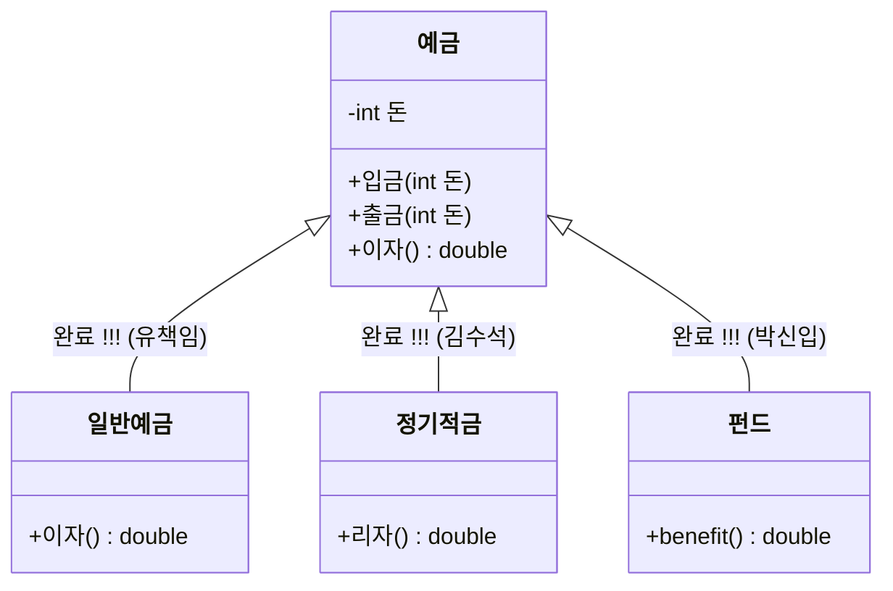
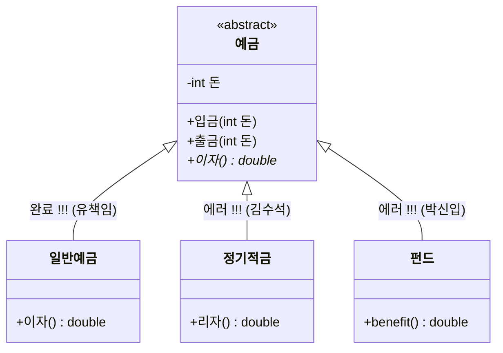

---
{"dg-publish":true,"permalink":"/02 - Knowledge/Computing/Java/OOP/Untitled/","tags":["type/study","context/studies","theme/java","status/completed"]}
---

# 추상 클래스(Abstract Class)

## 추상 클래스란?
- 하나 이상의 추상 메소드를 포함하는 클래스
- 일반적인 클래스는 구체적(oncrete)으로 데이터를 담아 인스턴스화하는 클래스인 반면
- 추상 클래스는 특정 개발 시점에 내용을 확정 지으면 안되거나 계획(틀)만을 세울 때 추상적인(abstract)데이터를 담고 있는 클래스
- 하나 이상의 추상 메서드를 보유함으로써 클래스를 불완전한 상태로 선언하여 서브 클래스로 하여금 메소드 오버라이드를 통해 추상 메서드를 완성하도록 구현을 강제

## 추상 클래스 특징
- 추상  메소드와 일반적인 메소드를 선언
- 추상 클래스를 상속받는 모든 서브 클래스들은 추상 메소드를 반드시 재정의(강제구현)
- new 연산자 사요을 통한 인스턴스화가 불가능
- 추상 클래스를 선언 할 때에는 abstract 키워드를 사용

## 추상 클래스 선언
- 클래스 선언에 abstract 키워드 붙임
- 공통 필드, 생성자, 일반 메서드 외에 추상 메서드를 하나 이상 추가
	- 모든 상속 받는 클래스에서 공통으로 사용될 메서드의 경우 일반 메서드로 구현
	- 상속받는 하위 클래스마다 기능이 다른 경우 추상 메서드로 선언
```java
[접근제어자] abstract class ClassName {
	//공통 필드 선언
	
	//추상 메서드 : 메서드의 body인 { } 블록이 없는 메서드
	//상속받은 하위 클래스는  반드시 재정의 (강제구현)
	[접근제어자] abstract ReturnType methodName1();
	
	// 일반 메소드
	[접근제어자] ReturnType methodName2() {
		//실행문 작성
	};
}
```

## 추상 메서드
- 추상 메소드는 작동 로직은 없고 실행부만 존재하는 껍데기만 있는 메소드
- modifier로 abstract 키워드를 선언하고 메서드의 body ({}) 가 없이 세미콜론 (;)으로  끝남
- 메소드이 구현부가 미완성이기 때문에 이를 오버라이드하는 하위 클래스의 실행부에 적절한(하위 클래스에 맞는) 세부적인 로직을 반드시 구현
```java
//추상 메서드 : 메서드의 body인 { } 블록이 없는 메서드
//상속받은 하위 클래스는  반드시 재정의 (강제구현)
[접근제어자] abstract ReturnType methodName1();
```

## 추상클래스 활용
- 공통 멤버 통합으로 중복 제거
	- 상속 특징을 이용하여 코드의 중복 제거, 코드 재사용성 증대 효과
- 구현의 강제성을 통한 기능 보장
- 규격에 맞는 설계 구현 -> 하위 클래스를 제어하는 효과

 
# part 5, 추상 클래스 (Abstract Class)

## 🚀 추상클래스 활용: 하위 클래스를 제어하는 효과

### 1. 일반 클래스 상속 (자율적 구현)

> 👨‍💼 **안팀장:** "입금과 출금은 모든 예금에 대해 공통이니 내가 구현했습니다. 상속 받아 구현하되 여러분은 각 예금에 맞는 이자 계산만 해 주세요. 문제 없겠죠???"

```java
public class 예금 {
    private int 돈;

    public void 입금(int 돈) { this.돈 += 돈; }
    public void 출금(int 돈) { this.돈 -= 돈; }

    public double 이자() {
        // 예금의 종류에 따라 이자계산 방식이 다름
        // 기본으로 0.0을 return하고 하위 클래스에 자율적으로 맡김 (Override)
        return 0.0;
    }
}
```



* **일반예금**: `public double 이자() { ... }` 👉 **완료 !!!**
* **정기적금**: `public double 리자() { ... }` 👉 **완료 !!!** (메서드 명 불일치)
* **펀드**: `public double benefit() { ... }` 👉 **완료 !!!** (메서드 명 불일치)

---

### 2. 추상 클래스 상속 (구현 강제)

> 👨‍💼 **안팀장:** "입금과 출금은 모든 예금에 대해 공통이니 내가 구현했습니다. 상속 받아 구현하되 여러분은 각 예금에 맞는 이자 계산만 해 주세요."

```java
public abstract class 예금 {
    private int 돈;

    public void 입금(int 돈) { this.돈 += 돈; }
    public void 출금(int 돈) { this.돈 -= 돈; }

    // 추상 메서드: 하위 클래스에서 반드시 구현해야 함
    public abstract double 이자(); 
}
```



* **일반예금**: `public double 이자() { ... }` 👉 **완료 !!!**
* **정기적금**: `public double 리자() { ... }` 👉 **에러 !!!** (추상 메서드 '이자' 미구현)
* **펀드**: `public double benefit() { ... }` 👉 **에러 !!!** (추상 메서드 '이자' 미구현)

### 다양한 객체 생성 방법
- 추상 클래스는 자신의 생성자를 이용하여 객체 생성 불가능(Anonymous Class로는 가능)
```java
Calendar calendar = new Calendar();//추상 클래스 자신의 생성자로 객체 생성(에러)
```

```java.util.Calendar API
public abstract class Calendar
exteds Object
implements Serializable, Cloneable, Comparable<Calendar>
```

### 하위 클래스를 참조하여 상위(추상) 클래스의 객체 생성(다형성, Polymorphism)
```java
Calendar calendar = new GregorianCalendar();
```

```java
public class GregorianCalendar extends Calendar
```

### 자신의 객체를 리턴하는 static method 이용
```java
Calendar calendar = Calendar.getInstance();
```

| static Calendar | getInstance(Locale aLocale)                                       |
| --------------- | ----------------------------------------------------------------- |
|                 | Gets a calendar using the default time zone and specified locale. |
| static Calendar | getInstance(Locale aLocale)                                       |
|                 | Gets a calendar using the specified time zone and default locale. |
| static Calendar | getInstance(Locale aLocale)                                       |
|                 | Gets a calendar with the specified time zone and locale.          |
