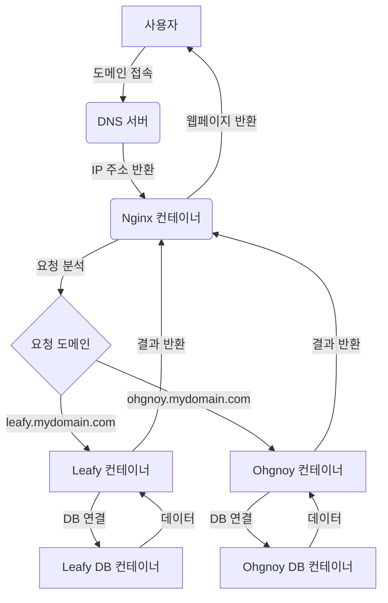
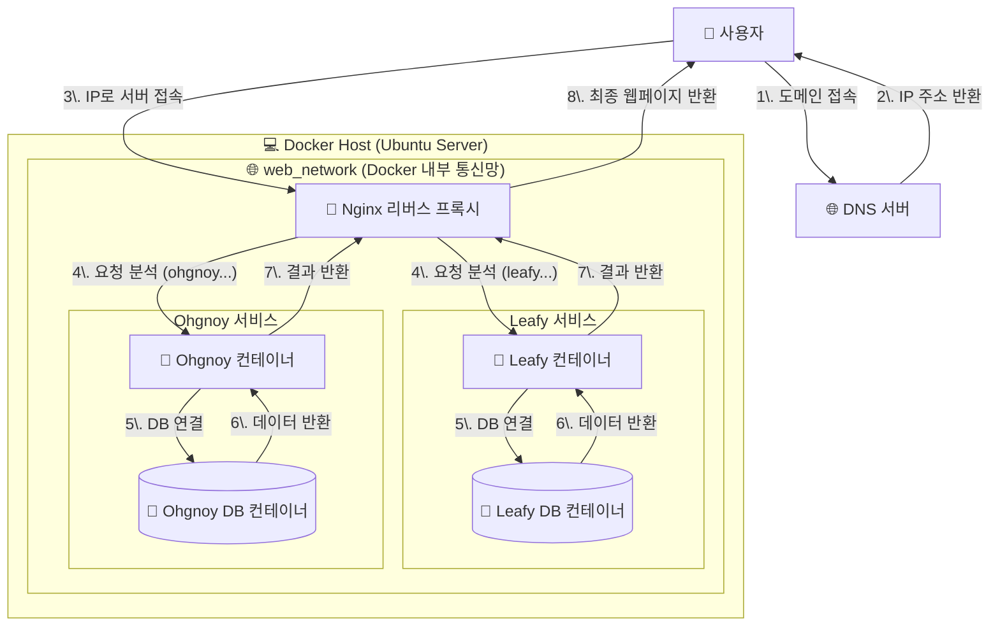

---
{"dg-publish":true,"permalink":"/project/setting/Docker/Docker/"}
---


- 노트북을 이용함 홈서버 -> [[project/setting/Home Server/Ubuntu Server 설치\|Ubuntu Server 설치]]
- 많은 프로젝트를 배포하다보니까 서로 충돌나서 교통정리가 좀 필요할 것 같다.
- 처음에는 다른 포트로 각각 지정해서하면되지않을까라고 생각했지만 그렇게 많이 하지는 않는것같다.(실은 이것도 호스트이름을 이용해서 도메인을 여러개 만들 수 있다는 사실을 몰라서 이렇게 생각했다.)
- nginx를 이용해서 환경을 구성 중인데... 이게 포트를 바꿀려면 뭔가 따로 설정을 해줘야 가능한 것으로 보였다.

- 그래서 서비스마다 다른 도메인을 지정해주고 그 도메인에 요청이 들어오면 nginx에서 불러오는 방식을 사용하기로 했다. 이게 포트번호를 사용하는 것보다 서비스 도메인을 구별할 때 훨씬 나을 것 같긴하다. 방법도 편할거같고

- nginx 컨테이너를 따로 빼서 관리하는게 나을 것 같아서 그렇게 구성할 생각이다.




- 위처럼 구현할려고했는데 ssl인증까지 한번에 할려고하니까 에러가 너무 많다
- 거기에 각 프로젝트에 `.yml`파일을 만들고 그걸 통합해서 할려는 방식으로 하니까 더 문제가 많이 발생했다.
- 관리의 편의성도 생각해서 통합된 `docker-compose.yml`으로 작성했다.
```docker-compose.yml
services:
  # leafy_api 서비스
  leafy_api:
    build:
      context: ./leafy
    container_name: leafy_api
    env_file:
      - ./leafy/.env
    restart: unless-stopped
    networks:
      - web_network
      - internal_db_network

  

  # leafy_db 서비스
  leafy_db:
    image: mysql:8.0
    container_name: leafy_db
    command: --default-authentication-plugin=mysql_native_password
    restart: always
    env_file:
      - ./leafy/.env
    volumes:
      - db_data:/var/lib/mysql
    networks:
      - internal_db_network

  

  # ohgnoy_api 서비스
  ohgnoy_api:
    build:
      context: ./ohgnoy
    container_name: ohgnoy_api
    env_file:
      - ./ohgnoy/.env
    restart: unless-stopped
    volumes:
      - ./ohgnoy:/usr/src/app
    networks:
      - web_network
      - internal_db_network

  

  # ohgnoy_db 서비스
  ohgnoy_db:
    image: mysql:8.0
    container_name: ohgnoy_db
    restart: always
    env_file:
      - ./ohgnoy/.env
    volumes:
      - mysql_data:/var/lib/mysql
    networks:
      - internal_db_network

  

  # code-server 서비스
  code_server:
    image: linuxserver/code-server:latest
    container_name: code_server
    env_file:
      - ./code-server/.env
    volumes:
      - ./config:/config
      - ./projects:/home/coder/projects
    restart: unless-stopped
    networks:
      - web_network

  

  # NGINX 리버스 프록시
  nginx_proxy:
    image: nginx:latest
    container_name: nginx_proxy
    ports:
      - "80:80"
    volumes:
      - ./nginx.conf:/etc/nginx/nginx.conf:ro
    depends_on:
      - leafy_api
      - ohgnoy_api
      - code_server
    networks:
      - web_network


volumes:
  db_data:
  mysql_data:

  
networks:
  web_network:
    external: true
  internal_db_network:
    internal: true
```



