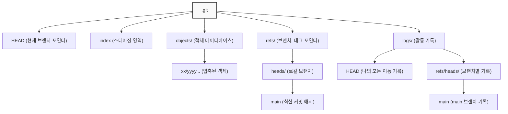

---
{"dg-publish":true,"permalink":"/project/study/Git/내부구조/"}
---

##### Git 개체 (Objects)
- Key-Value 데이터 저장소를 기본으로 한다.
- `git hash-object` = 데이터를 주면 `.git/objects` 디렉토리에 저장하고 접근할 수 있는 key를 알려줌.
    - 여기서 key는 체크섬 해시.
    - `-w` 옵션이 없으면 저장하지 않고 key만 보여준다. (만약 이 파일을 만든다면 이런 key로 저장된다고 보여주는 듯하다.)
    - `.git/objects` 디렉토리에 해시의 두 글자를 따서 디렉토리 이름이고 그 아래 38글자로 파일 이름으로 사용한다.

- `git cat-file` = Git 데이터베이스에 개체를 저장한 데이터를 불러올 수 있다.
    - `-p` 옵션으로 파일 내용을 출력한다.
    - `-t` 어떤 종류의 개체인지 확인한다.

- 기존 파일을 수정하면 Git 데이터베이스에서는 두 가지 버전으로 저장되어있다. 그래서 이전 버전의 파일을 불러올 수도 있다.

- 위 명령어들은 key 값 즉 체크섬 해시를 이용한다. 하지만 키를 외워서 사용하는 건 너무 어렵다. 파일 이름은 저장도 안 하고 파일 내용만 저장한다. = **Blob 개체**

##### Tree 개체
- 파일 이름을 저장하며 여러 개를 한꺼번에 저장할 수 있다.
- 모든 것은 Tree와 Blob 개체로 저장한다.
    - Tree는 디렉토리에 대응한다.
    - Blob는 Inode나 일반 파일에 대응한다.
    - Tree 개체의 항목에 Blob개체나 하위 Tree개체를 가리키는 SHA-1 포인터, 파일 모드, 개체 타입, 파일 이름이 들어 있다.

- `git update-index` = Staging Area(Index)에 파일을 추가하여 Tree를 만들 준비를 한다.

- `git write-tree` = 현재 Staging Area의 상태를 기반으로 하나의 Tree 개체를 생성하고 그 key를 반환한다.

- `git read-tree` = 기존 Tree 개체를 읽어서 Staging Area에 추가하며, `--prefix` 옵션으로 하위 디렉토리를 만들 수 있다.

##### 커밋 개체

- 스냅샷(Tree)을 누가, 언제, 왜 저장했는지에 대한 메타데이터를 저장한다.
- 내용: 최상위 Tree의 SHA-1, 부모(이전) 커밋의 SHA-1, 작성자(Author)와 커미터(Committer) 정보, 시간, 커밋 메시지로 구성된다.
- `git commit-tree` = Tree의 key와 부모 커밋의 key(-p 옵션)를 받아 새로운 커밋 개체를 생성한다.
- 커밋들이 연결리스트로 구성되어 하나의 완전한 히스토리를 형성한다.(따로 관리는 안 한다고했던가?)

##### 개체 저장 방식

- 모든 개체는 `헤더(header) + 내용(content)` 구조를 가진다.
- 헤더 형식은 `"{개체 타입} {내용의 바이트 크기}\0"` 이다. (예: `blob 16\0`)
- 최종 SHA-1 key는 '헤더+내용'을 합친 데이터의 해시값이다.
- 실제 파일로 저장될 때는 이 '헤더+내용' 데이터를 `zlib`으로 압축하여 저장한다.

##### Hash와 Map

## .git 구조

### SHA 해시 (SHA-1)

- 입력 데이터를 고정된 길이의 고유한 문자열(해시)로 변환하는 단방향 함수. 
- 데이터가 조금만 달라져도 결과 해시값이 완전히 달라져 데이터의 무결성을 보장함.

- SHA-1 해시 생성을 위해 내장된 `crypto` 모듈을 사용.
    - `crypto.createHash('sha1')`: SHA-1 해시 객체를 생성.
    - `.update(data)`: 해시를 계산할 데이터를 주입.
    - `.digest('hex')`: 최종 해시값을 16진수 문자열로 추출.

#### 관련 명령어
- `git hash-object <파일명>`
	- 파일의 내용을 기반으로 Git이 생성할 Blob 객체의 해시값을 미리 계산해서 보여줌. 

### Index 파일 구조 (.git/index)

- Staging Area의 역할을 하는 고도로 최적화된 바이너리 파일.
- 크게 헤더, 파일 엔트리 목록, 확장 세 부분으로 구성됨.
#### 헤더 (12바이트)**:
- 시그니처 (4바이트): 항상 'DIRC' 문자열.
- 버전 (4바이트): Index 포맷 버전. 
- 엔트리 개수 (4바이트): Index에 포함된 파일의 총개수.
#### 파일 엔트리 (가변 길이):    
- 파일의 메타데이터 (생성/수정 시간, 권한 모드, 파일 크기 등).
- **Blob SHA-1 (20바이트)**: 파일 내용에 해당하는 Blob 객체의 바이너리 해시.
- **파일 경로**: `\0`(널 문자)로 끝나는 파일의 전체 경로.
- **패딩**: 성능을 위해 각 엔트리를 8바이트 경계로 맞추는 패딩 바이트.

#### 관련 명령어
- `git ls-files --stage`
	- 바이너리 형태의 Index 파일을 Git이 파싱하여 사람이 읽을 수 있는 형태로 보여줌.
	- 각 파일의 모드, Blob 해시, 스테이지 번호, 파일 경로를 확인할 수 있음.

### zlib 라이브러리 (압축)

- Git이 객체를 저장할 때 사용하는 DEFLATE 알고리즘 기반의 압축 라이브러리.
- 데이터 손실이 없는 비손실 압축 방식임.
- Node.js zlib 모듈
    - 압축 (`zlib.deflateSync(input)`)
	    - `Buffer` 형태의 데이터를 입력받아 압축하고, 압축된 데이터가 담긴 새로운 `Buffer`를 반환.
    - 압축 해제 (`zlib.inflateSync(input)`)
	    - 압축된 `Buffer`를 입력받아 원본 데이터가 담긴 `Buffer`로 복원.